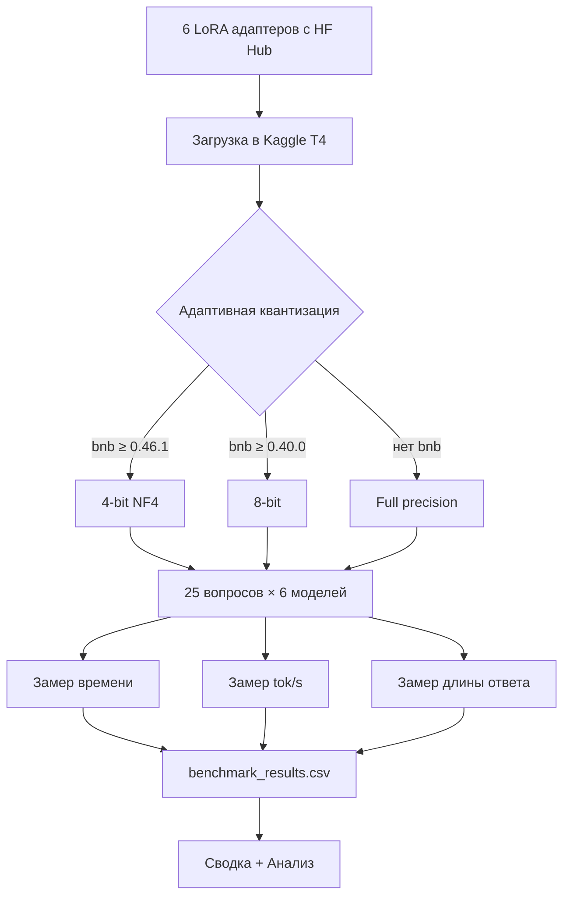
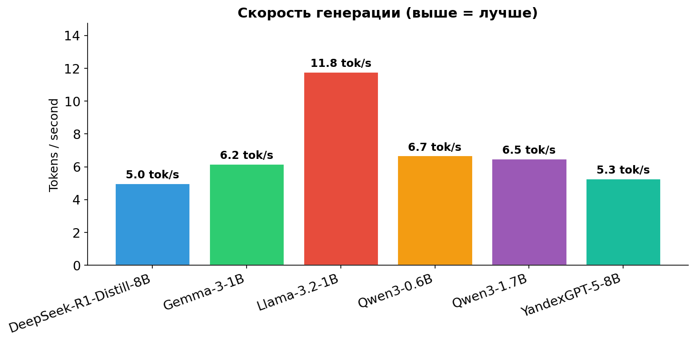
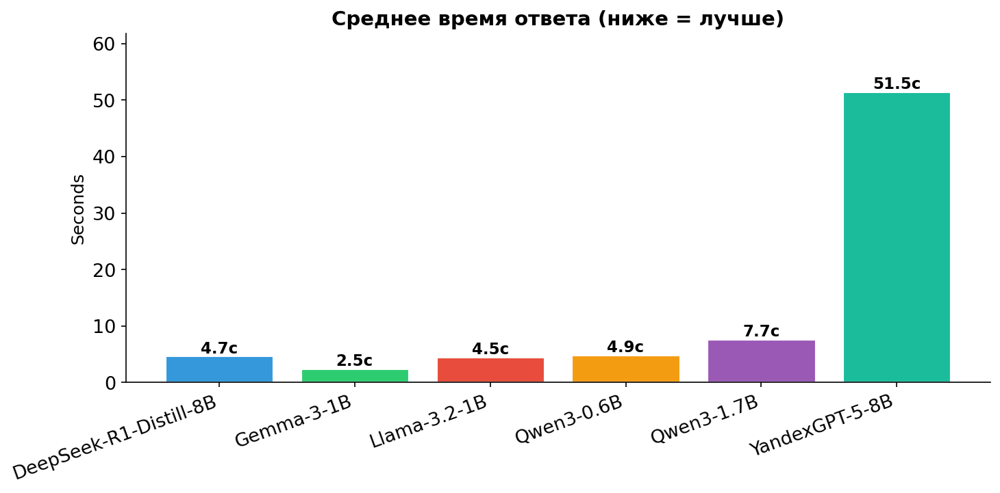
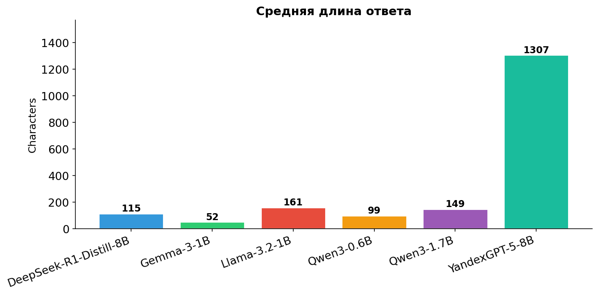
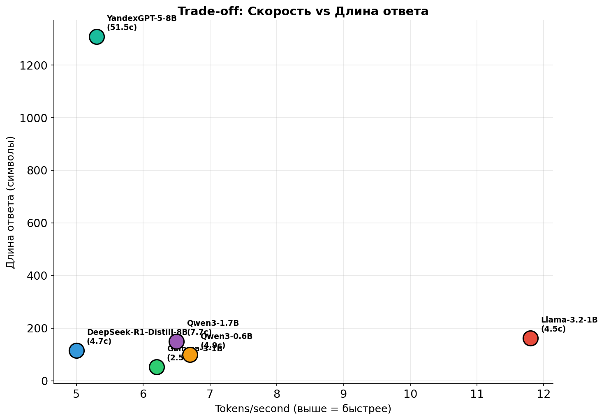
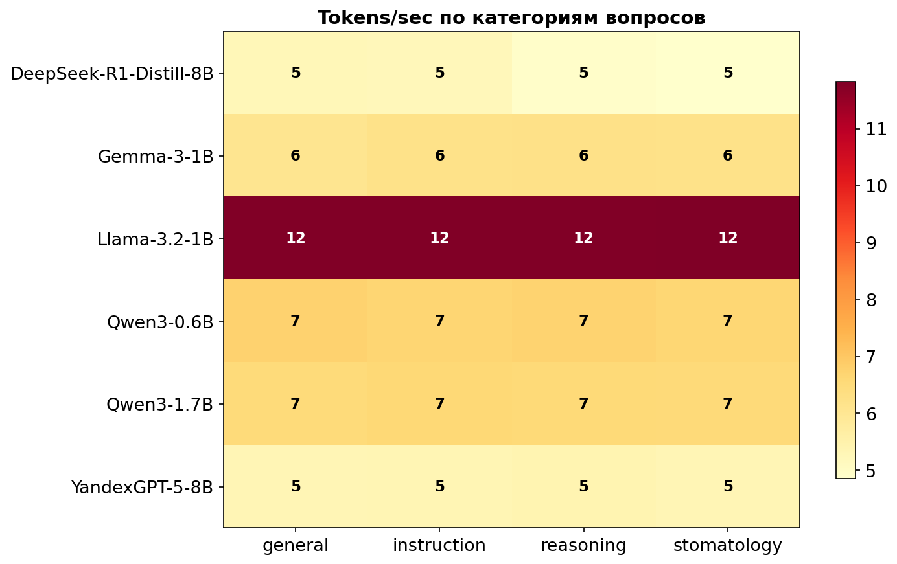

# LLM Benchmark: LoRA Fine-tuning + Сравнение русских медицинских моделей

[](https://python.org)
[](https://pytorch.org)
[](https://kaggle.com)
[](https://huggingface.co/HolSoul)

---

## Часть 1. LoRA Fine-tuning

17 моделей были дообучены на русском медицинском датасете **stomatology-patient** с использованием **Low-Rank Adaptation (LoRA)** и **TRL SFTTrainer**.

### Технологии

| Компонент | Инструмент |
|-----------|-----------|
| Fine-tuning | LoRA (PEFT) + TRL SFTTrainer |
| Quantization | 4-bit NF4 / 8-bit (bitsandbytes) |
| Платформа | Hugging Face Hub |
| Chat templates | apply_chat_template (мультиформат) |

### Модели

| # | Модель | Base | Размер |
|---|--------|------|--------|
| 1 | Qwen3-0.6B | Qwen/Qwen3-0.6B | 0.6B |
| 2 | Gemma-3-1B | google/gemma-3-1b-it | 1B |
| 3 | Llama-3.2-1B | meta-llama/Llama-3.2-1B-Instruct | 1B |
| 4 | Qwen3-1.7B | Qwen/Qwen3-1.7B | 1.7B |
| 5 | Llama-3-8B | meta-llama/Meta-Llama-3-8B-Instruct | 8B |
| 6 | Mistral-7B | mistralai/Mistral-7B-Instruct-v0.3 | 7B |
| 7 | Qwen3-8B | Qwen/Qwen3-8B | 8B |
| 8 | DeepSeek-R1-Distill-8B | deepseek-ai/DeepSeek-R1-Distill-Llama-8B | 8B |
| 9 | YandexGPT-5-Lite-8B | yandex/YandexGPT-5-Lite-8B-instruct | 8B |

Все адаптеры доступны на Hugging Face: [HolSoul/models](https://huggingface.co/HolSoul/models)

---

## Часть 2. Benchmark

Систематическое сравнение 6 моделей (от 0.6B до 8B параметров) на 25 вопросах по 4 категориям.

### Методология



### Тестовый набор

25 вопросов, разделённых на 4 категории:

| Категория | Описание | Кол-во |
|-----------|----------|--------|
| **stomatology** | Профессиональные медицинские вопросы | 10 |
| **general** | Общие вопросы, письма, рецепты | 5 |
| **reasoning** | Диагностические кейсы | 5 |
| **instruction** | Составление планов и протоколов | 5 |

### Результаты

| Модель | Размер | Среднее время | Tok/с | Средняя длина | Ошибки |
|--------|--------|---------------|-------|---------------|--------|
| Qwen3-0.6B | 0.6B | 4.9с | 7 | 100 символов | 0 |
| Gemma-3-1B | 1B | 2.5с | 6 | 53 символа | 0 |
| Llama-3.2-1B | 1B | 4.5с | 12 | 162 символа | 0 |
| Qwen3-1.7B | 1.7B | 7.7с | 7 | 150 символов | 0 |
| DeepSeek-R1-Distill-8B | 8B | 4.7с | 5 | 115 символов | 0 |
| YandexGPT-5-8B | 8B | 51.5с | 5 | 1308 символов | 0 |

### Графики


*Скорость генерации токенов (выше = лучше)*


*Среднее время генерации ответа (ниже = лучше)*


*Средняя длина ответа в символах*


*Trade-off: скорость генерации vs длина ответа*


*Скорость генерации по категориям вопросов (tok/s)*

---

## Быстрый старт

```bash
# Локально (GPU 16GB+)
pip install -r requirements.txt
python benchmark_kaggle.py

# На Kaggle
# 1. Загрузи benchmark_kaggle.py как Notebook
# 2. Accelerator → GPU T4 x2
# 3. Add secret: HF_TOKEN
# 4. Run All (~30-60 мин)
```

## Структура

```
llm-benchmark/
├── benchmark_kaggle.py     # Скрипт для Kaggle GPU
├── test_set.jsonl          # 25 тестовых вопросов
├── benchmark_results.csv   # Результаты бенчмарка
├── benchmark_summary.md    # Сводная таблица
├── analysis.ipynb          # Визуализация
├── plot_charts.py          # Генерация графиков
├── requirements.txt
└── README.md
```

## Ссылки

- **GitHub**: [HolSoul/LLM-benchmark](https://github.com/HolSoul/LLM-benchmark)
- **Hugging Face модели**: [HolSoul/models](https://huggingface.co/HolSoul/models)

## Лицензия

MIT License
